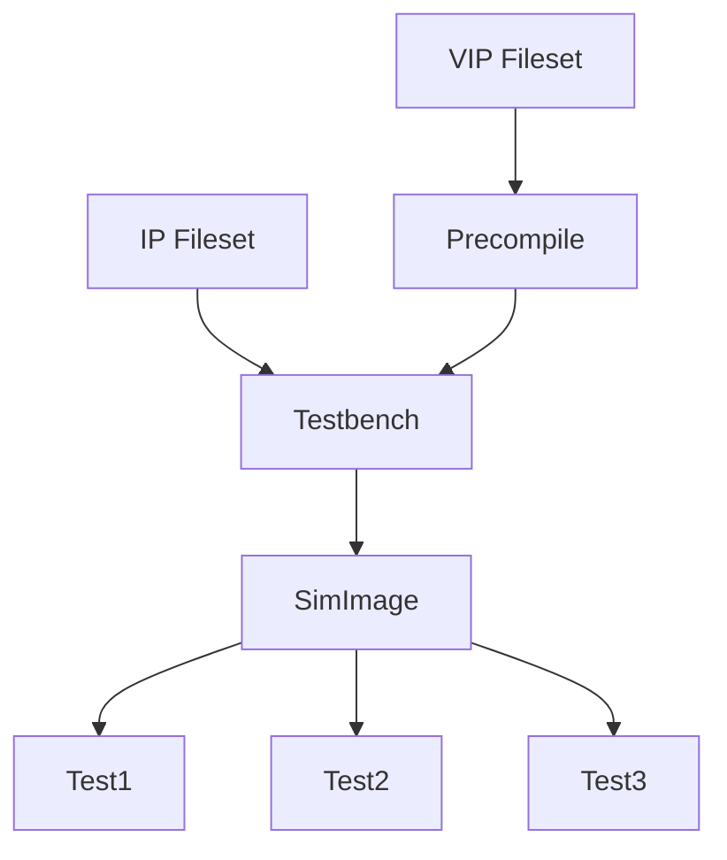

## DV-Flow - Flow Automation for Silicon Design

DV Flow is a set of tools focused on automating design and verification
activities for silicon design. Three categories of material are provided:

- **Specification** - Flows are specified using a YAML schema. Flows consist 
  of tasks related by dataflow.
- **Libraries** - Libraries provide pre-defined tasks that implement common
  operations, such as building a simulator image.
- **Technology** - Tools for developing and executing flow specifications

